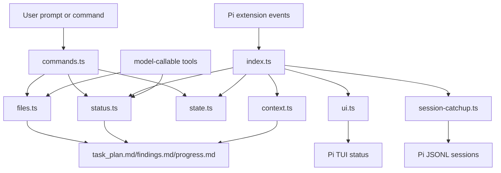

# feat: Build Pi-native Planning-with-Files Package

## Overview

Build a Pi-native `planning-with-files` package that combines a Pi skill, a TypeScript extension, user commands, model-callable tools, bounded context injection, status parsing, session catchup, and lightweight TUI status.

The work should be delivered in phases so the implementation stays grounded:

1. **Phase 1 — package skeleton and pure core modules**: no Pi lifecycle complexity yet.
2. **Phase 2 — commands, tools, and minimal hook parity**: make the workflow usable.
3. **Phase 3 — full parity reliability**: catchup, 2-action rule, error reminders.
4. **Phase 4 — polish, docs, and package verification**: make it installable and understandable.

This plan intentionally avoids implementation code. It defines boundaries, sequencing, files, tests, and verification outcomes.

---

## Problem Frame

The upstream `planning-with-files` project works best in agents that support lifecycle hooks. The current Pi integration is skill-only and therefore loses much of the workflow’s reliability. Pi has a native extension system that can provide equivalent behavior through Pi events, commands, tools, session state, and TUI APIs.

The goal is to make the workflow durable in Pi without copying foreign shell hook systems.

---

## Requirements Trace

- R1. Provide a Pi package that loads both a skill and an extension.
- R2. Preserve the upstream 3-file pattern: `task_plan.md`, `findings.md`, `progress.md`.
- R3. Provide `/plan` to create or continue planning files without overwriting existing files.
- R4. Provide `/plan-status` that reports parsed status without invoking the model.
- R5. Inject bounded active-plan context when `task_plan.md` exists.
- R6. Remind the agent to update `progress.md` after code/file mutations.
- R7. Check completion at the end of an agent turn without forcing loops or fighting user stop/pause intent.
- R8. Track read/search-like operations and remind the agent to update `findings.md` after the 2-action threshold.
- R9. Detect tool errors and remind the agent to log errors and avoid repeated failures.
- R10. Provide Pi-native session catchup for prior Pi JSONL sessions.
- R11. Show lightweight TUI status when UI is available.
- R12. Document install, usage, trust boundaries, limitations, and fallback behavior.

---

## Scope Boundaries

- Do not implement code during planning.
- Do not port Claude/Codex/Gemini shell hooks as the primary mechanism.
- Do not force planning on simple tasks when no active plan exists.
- Do not auto-inject full `findings.md` into model context.
- Do not auto-write untrusted external content into `task_plan.md`.
- Do not add configurable planning subdirectories in the first implementation.
- Do not add a broad project-management system beyond the 3-file workflow.
- Do not require OpenCode, Claude Code, Codex, Gemini, Cursor, or other harness config.

### Deferred to Follow-Up Work

- Optional `/plan-off` command unless the user asks for it before implementation.
- Advanced TUI widget beyond footer status.
- Configurable planning file directory.
- Automatic migration of existing `.pi/skills/planning-with-files` installs.
- Native marketplace publishing steps beyond a local/package-ready manifest.

---

## Context & Research

### Relevant Code and Patterns

- `planning-with-files/skills/planning-with-files/SKILL.md` — canonical workflow instructions and safety boundary.
- `planning-with-files/skills/planning-with-files/templates/task_plan.md` — canonical task plan template.
- `planning-with-files/skills/planning-with-files/templates/findings.md` — canonical findings template.
- `planning-with-files/skills/planning-with-files/templates/progress.md` — canonical progress template.
- `planning-with-files/skills/planning-with-files/scripts/check-complete.sh` — upstream completion check behavior to preserve semantically, not mechanically.
- `planning-with-files/.hermes/plugins/planning-with-files/planning_files.py` — useful reference for status parsing, file initialization, and Hermes tool boundaries.
- `planning-with-files/.hermes/plugins/planning-with-files/hooks.py` — useful reference for pre-LLM context and post-tool reminder behavior.
- `planning-with-files/.pi/skills/planning-with-files/SKILL.md` — current Pi skill-only baseline to replace/upgrade.
- `superpowers/docs/plans/2025-11-22-opencode-support-design.md` — example of adapting a cross-agent package to a new harness.

### Pi Documentation and Examples to Follow

- Pi `docs/extensions.md` — extension lifecycle, commands, tools, context events, custom messages, and state.
- Pi `docs/skills.md` — skill discovery and Agent Skills constraints.
- Pi `docs/packages.md` — package manifest shape and install behavior.
- Pi `docs/session.md` — session JSONL structure and `SessionManager` concepts.
- Pi `docs/compaction.md` — compaction/branch summary behavior that affects catchup.
- Pi `docs/tui.md` — footer status, widgets, and UI behavior.
- Pi `examples/extensions/plan-mode/index.ts` — closest local example for commands, state, tool gating, status, widgets, and event wiring.
- Pi `examples/extensions/plan-mode/utils.ts` — useful pattern for pure helpers plus tests.

### Institutional Learnings

- Upstream `planning-with-files` changelog shows repeated hook portability and session-catchup issues. Avoid shell/Python as the normal path.
- Upstream security fixes emphasize bounded catchup output and clear labels for historical/untrusted context.
- Pi’s extension APIs make it possible to replace hook stdout with structured event handling.

### External References

- None required for the first implementation plan. The work is mostly an adaptation to local Pi APIs and upstream repo behavior already inspected.

---

## Key Technical Decisions

- **Use a Pi package with both skill and extension**: skills-only is not reliable enough; extension-only would lose progressive-disclosure instructions.
- **Implement core behavior in TypeScript modules**: avoids shell/PowerShell/Python portability issues.
- **Keep scripts bundled only as fallback assets**: preserves upstream familiarity without depending on them.
- **Treat `task_plan.md` as active-plan marker**: matches upstream recovery behavior and avoids hidden state dependence.
- **Bound context injection**: improves safety and avoids context bloat.
- **Remind rather than block in v1**: keeps automation helpful and avoids hostile stop-hook behavior.
- **Use `/plan` plus `/pwf` alias**: `/plan` matches upstream expectations; `/pwf` provides a lower-collision fallback.
- **Keep footer status in v1; defer rich widget**: gives visibility without overbuilding UI.
- **Use Pi session parsing for catchup**: current upstream Pi catchup does not understand Pi JSONL sessions.

---

## Open Questions

### Resolved During Planning

- **Should the primary command be `/plan`?** Yes. It matches upstream usage. Add `/pwf` as an alias if Pi command registration permits it cleanly.
- **Should `agent_end` auto-continue in v1?** No. It should remind only, with at most one completion reminder per user prompt.
- **Should the first version include a rich TUI widget?** No. Include footer status first. Add widget later if needed.
- **Should analytics templates be bundled?** Yes, bundle template assets. Delay special analytics command UX.
- **Should `/plan-off` be in v1?** No, unless the user explicitly asks before implementation.

### Deferred to Implementation

- **Exact package test runner**: choose the smallest compatible runner after package scaffolding is in place.
- **Exact Pi custom-message rendering**: determine during implementation whether default rendering is enough.
- **Exact `SessionManager` import surface**: verify with installed Pi package typings while coding.
- **Whether `withFileMutationQueue` is necessary for init tool writes**: decide after confirming custom tool API availability and implementation shape.

---

## Output Structure

Target package structure:

```text
pi-planning-with-files/
├── package.json
├── README.md
├── extensions/
│   └── planning-with-files/
│       ├── index.ts
│       ├── types.ts
│       ├── security.ts
│       ├── files.ts
│       ├── status.ts
│       ├── context.ts
│       ├── state.ts
│       ├── commands.ts
│       ├── tools.ts
│       ├── ui.ts
│       └── session-catchup.ts
├── skills/
│   └── planning-with-files/
│       ├── SKILL.md
│       ├── examples.md
│       ├── reference.md
│       ├── templates/
│       │   ├── task_plan.md
│       │   ├── findings.md
│       │   ├── progress.md
│       │   ├── analytics_task_plan.md
│       │   └── analytics_findings.md
│       └── scripts/
│           ├── init-session.sh
│           ├── init-session.ps1
│           ├── check-complete.sh
│           ├── check-complete.ps1
│           └── session-catchup.py
└── tests/
    └── planning-with-files/
        ├── security.test.ts
        ├── files.test.ts
        ├── status.test.ts
        ├── context.test.ts
        ├── state.test.ts
        └── session-catchup.test.ts
```

The exact test directory can change if the final package convention differs, but each feature-bearing module should have an explicit nearby test target.

---

## High-Level Technical Design

> *This illustrates the intended approach and is directional guidance for review, not implementation specification. The implementing agent should treat it as context, not code to reproduce.*



Main flow:

1. `/plan` initializes files and activates state.
2. `before_agent_start` and `context` inject bounded active-plan context.
3. `tool_call` and `tool_result` update reminder state.
4. `agent_end` checks completion and shows bounded reminders.
5. `/plan-catchup` scans prior Pi sessions and surfaces unsynced context.

---

## Phased Delivery

### Phase 1 — Package skeleton and pure core

Purpose: establish the package, assets, and pure helpers without complex Pi event behavior.

Units: U1–U5.

### Phase 2 — Usable Pi workflow

Purpose: add commands, tools, minimal event wiring, progress reminders, completion reminders, and footer status.

Units: U6–U10.

### Phase 3 — Full parity reliability

Purpose: add Pi-native session catchup, 2-action findings reminder, and tool error reminder/escalation.

Units: U11–U13.

### Phase 4 — Documentation, package hardening, and verification

Purpose: document, test, and prepare package for local installation and future publication.

Units: U14–U16.

---

## Implementation Units

### Phase 1 — Package skeleton and pure core

- [ ] U1. **Create package skeleton and copy skill assets**

**Goal:** Establish the package layout and include the canonical skill, templates, examples, reference docs, and fallback scripts.

**Requirements:** R1, R2, R12

**Dependencies:** None

**Files:**
- Create: `pi-planning-with-files/package.json`
- Create: `pi-planning-with-files/README.md`
- Create: `pi-planning-with-files/skills/planning-with-files/SKILL.md`
- Create: `pi-planning-with-files/skills/planning-with-files/examples.md`
- Create: `pi-planning-with-files/skills/planning-with-files/reference.md`
- Create: `pi-planning-with-files/skills/planning-with-files/templates/task_plan.md`
- Create: `pi-planning-with-files/skills/planning-with-files/templates/findings.md`
- Create: `pi-planning-with-files/skills/planning-with-files/templates/progress.md`
- Create: `pi-planning-with-files/skills/planning-with-files/templates/analytics_task_plan.md`
- Create: `pi-planning-with-files/skills/planning-with-files/templates/analytics_findings.md`
- Create: `pi-planning-with-files/skills/planning-with-files/scripts/init-session.sh`
- Create: `pi-planning-with-files/skills/planning-with-files/scripts/init-session.ps1`
- Create: `pi-planning-with-files/skills/planning-with-files/scripts/check-complete.sh`
- Create: `pi-planning-with-files/skills/planning-with-files/scripts/check-complete.ps1`
- Create: `pi-planning-with-files/skills/planning-with-files/scripts/session-catchup.py`
- Test: `pi-planning-with-files/tests/planning-with-files/package-assets.test.ts`

**Approach:**
- Use the canonical upstream skill and template assets as source material.
- Rewrite the Pi `SKILL.md` language so it no longer says hooks are unsupported.
- Keep fallback scripts bundled but clearly label native extension behavior as the normal path.
- Keep package manifest minimal and Pi-native.

**Patterns to follow:**
- `planning-with-files/skills/planning-with-files/SKILL.md`
- `planning-with-files/.pi/skills/planning-with-files/package.json`
- Pi package docs in `docs/packages.md`

**Test scenarios:**
- Happy path: package manifest declares one extension path and one skill path.
- Happy path: required skill files exist at the expected package-relative paths.
- Edge case: script assets exist but are not referenced as required runtime dependencies in the extension manifest.
- Error path: missing template asset is reported by the asset test.

**Verification:**
- Package structure contains all required skill assets.
- `package.json` is valid JSON and declares Pi resources.
- No package file says Pi hooks are unsupported.

---

- [ ] U2. **Define shared types and security helpers**

**Goal:** Create the shared type vocabulary and small safety/classification helpers used by all later modules.

**Requirements:** R5, R6, R7, R8, R9, R12

**Dependencies:** U1

**Files:**
- Create: `pi-planning-with-files/extensions/planning-with-files/types.ts`
- Create: `pi-planning-with-files/extensions/planning-with-files/security.ts`
- Test: `pi-planning-with-files/tests/planning-with-files/security.test.ts`

**Approach:**
- Define concrete planning file names, phase statuses, plan status shape, reminder state, and catchup report shape.
- Add helpers for planning-file detection, read-like tool classification, mutation tool classification, stop/pause override detection, truncation, and error signature creation.
- Keep helpers pure and independent from Pi runtime objects.

**Patterns to follow:**
- `pi-pwf/2026-04-23-pi-planning-with-files-design-spec.md` Sections 6.2 and 6.11.
- `planning-with-files/skills/planning-with-files/SKILL.md` Security Boundary.

**Test scenarios:**
- Happy path: `task_plan.md`, `findings.md`, and `progress.md` are recognized as planning files across relative paths.
- Happy path: `read`, `grep`, `find`, `web_search`, `fetch_content`, and `code_search` classify as read/search-like tools.
- Happy path: `write` and `edit` classify as mutation tools.
- Edge case: files such as `docs/task_plan.md.bak` do not classify as planning files.
- Edge case: stop override detection recognizes clear phrases like “pause here” and “stop anyway”.
- Error path: ambiguous phrases do not suppress completion reminders.
- Error path: truncation returns a clear truncated marker when limits are exceeded.

**Verification:**
- Later modules can import shared types and helpers without circular dependencies.
- Security helpers avoid broad or surprising matches.

---

- [ ] U3. **Implement planning file and template management**

**Goal:** Provide native TypeScript file initialization and template loading without relying on shell scripts.

**Requirements:** R2, R3

**Dependencies:** U1, U2

**Files:**
- Create: `pi-planning-with-files/extensions/planning-with-files/files.ts`
- Test: `pi-planning-with-files/tests/planning-with-files/files.test.ts`

**Approach:**
- Resolve project directory from Pi `ctx.cwd`.
- Resolve package-local template paths relative to the extension/skill package layout.
- Create missing planning files only; never overwrite existing files.
- Support default templates in v1.
- Bundle analytics templates but avoid adding special analytics command UX until later unless trivial.

**Patterns to follow:**
- `planning-with-files/scripts/init-session.sh` for behavior intent.
- `planning-with-files/.hermes/plugins/planning-with-files/planning_files.py` for safer copy-if-missing behavior.

**Test scenarios:**
- Happy path: empty temp project creates all three planning files from templates.
- Happy path: project with one existing planning file creates only the missing two.
- Edge case: existing `task_plan.md` content remains unchanged after initialization.
- Edge case: file paths are project-root-relative and do not create a subdirectory.
- Error path: missing template returns a structured error instead of creating an empty or misleading file.
- Error path: filesystem write failure is surfaced with the target file path.

**Verification:**
- Initialization can be called from commands and tools with the same result shape.
- No shell or Python script is needed to create planning files.

---

- [ ] U4. **Implement status parsing and completion checks**

**Goal:** Parse planning markdown into reliable status for commands, tools, UI, and completion checks.

**Requirements:** R4, R7

**Dependencies:** U2, U3

**Files:**
- Create: `pi-planning-with-files/extensions/planning-with-files/status.ts`
- Test: `pi-planning-with-files/tests/planning-with-files/status.test.ts`

**Approach:**
- Parse canonical phase headings with `**Status:**` lines.
- Support bracket status and simple table status as fallback formats.
- Extract goal, current phase, recent progress tail, error count, file existence, and completion state.
- Keep parser tolerant. Unknown formats should produce `unknown` phase status, not crashes.

**Patterns to follow:**
- `planning-with-files/scripts/check-complete.sh`
- `planning-with-files/.hermes/plugins/planning-with-files/planning_files.py`
- `planning-with-files/commands/status.md`

**Test scenarios:**
- Happy path: canonical 5-phase template reports correct counts and current phase.
- Happy path: all phases marked complete reports `complete: true`.
- Happy path: table-based phase status parses complete/in-progress/pending counts.
- Edge case: no phases found reports incomplete with total `0`.
- Edge case: mixed-case statuses normalize correctly.
- Edge case: error table header rows are not counted as real errors.
- Error path: malformed markdown returns partial status with warnings rather than throwing.

**Verification:**
- `/plan-status`, tools, UI, and `agent_end` can rely on one shared status function.
- Completion rule matches the design spec.

---

- [ ] U5. **Implement bounded context and reminder builders**

**Goal:** Build safe, concise active-plan context and reminder text for Pi events.

**Requirements:** R5, R6, R8, R9

**Dependencies:** U2, U4

**Files:**
- Create: `pi-planning-with-files/extensions/planning-with-files/context.ts`
- Test: `pi-planning-with-files/tests/planning-with-files/context.test.ts`

**Approach:**
- Build a standard active-plan context block from `PlanStatus`.
- Include goal, current phase, phase counts, current phase details, recent progress, and pending reminders.
- Do not include full `findings.md`.
- Apply truncation consistently and label truncation.
- Deduplicate repeated reminders in one context block.

**Patterns to follow:**
- `planning-with-files/.cursor/hooks/user-prompt-submit.sh`
- `planning-with-files/.hermes/plugins/planning-with-files/hooks.py`
- Design spec Section 6.5.

**Test scenarios:**
- Happy path: active plan context includes goal, current phase, progress count, and recent progress.
- Happy path: pending progress reminder appears once.
- Edge case: long plan preview is truncated and labeled.
- Edge case: no recent progress omits empty section cleanly.
- Error path: context builder handles missing goal/current phase without throwing.
- Security path: full `findings.md` content is never included by context builder.

**Verification:**
- Context output is suitable for hidden custom messages or context event injection.
- Context builder has no Pi runtime dependency.

---

### Phase 2 — Usable Pi workflow

- [ ] U6. **Implement extension state persistence**

**Goal:** Track lightweight coordination state across events and session reloads.

**Requirements:** R5, R6, R7, R8, R9

**Dependencies:** U2

**Files:**
- Create: `pi-planning-with-files/extensions/planning-with-files/state.ts`
- Test: `pi-planning-with-files/tests/planning-with-files/state.test.ts`

**Approach:**
- Store active flag, project directory, pending reminders, read-like count, completion reminder count, repeated error signature/count, and last user intent.
- Reconstruct from latest Pi custom entry on `session_start`.
- Append new custom state entries only when state changes materially.
- Keep full file contents and tool outputs out of state.

**Patterns to follow:**
- Pi extension docs for `pi.appendEntry`.
- `examples/extensions/plan-mode/index.ts` state persistence approach.

**Test scenarios:**
- Happy path: default state starts inactive with no reminders.
- Happy path: serialized state restores reminders and counters.
- Edge case: corrupt or partial saved state falls back to defaults.
- Edge case: changed state is recognized as needing persistence.
- Error path: state reconstruction ignores unrelated custom entries.

**Verification:**
- Event handlers can share and persist state through one module.
- No large or sensitive data is stored in custom entries.

---

- [ ] U7. **Register model-callable planning tools**

**Goal:** Expose structured model tools for initializing files, reading status, and checking completion.

**Requirements:** R1, R3, R4, R7

**Dependencies:** U3, U4

**Files:**
- Create: `pi-planning-with-files/extensions/planning-with-files/tools.ts`
- Test: `pi-planning-with-files/tests/planning-with-files/tools.test.ts`

**Approach:**
- Register `planning_with_files_init`, `planning_with_files_status`, and `planning_with_files_check_complete`.
- Keep tools thin: each delegates to `files.ts` and `status.ts`.
- Use strict schemas with minimal parameters.
- Ensure prompt snippets/guidelines name each tool explicitly.

**Patterns to follow:**
- `planning-with-files/.hermes/plugins/planning-with-files/tools.py`
- Pi `docs/extensions.md` custom tool examples.

**Test scenarios:**
- Happy path: init tool reports created and existing planning files.
- Happy path: status tool returns parsed phase counts.
- Happy path: check-complete tool returns clear complete/incomplete message.
- Edge case: omitted `cwd` uses Pi current working directory.
- Error path: invalid template parameter is rejected by schema.
- Error path: file initialization failure surfaces structured error.

**Verification:**
- Tools appear in Pi tool registry when extension loads.
- Tool results match the shared internal status shape.

---

- [ ] U8. **Register `/plan`, `/pwf`, `/plan-status`, and `/plan-check` commands**

**Goal:** Provide user-facing commands that make the workflow easy to start and inspect.

**Requirements:** R3, R4, R7

**Dependencies:** U3, U4, U5, U6

**Files:**
- Create: `pi-planning-with-files/extensions/planning-with-files/commands.ts`
- Test: `pi-planning-with-files/tests/planning-with-files/commands.test.ts`

**Approach:**
- `/plan [task]` initializes missing files, activates state, updates UI, and sends a planning kickoff user message when appropriate.
- `/pwf [task]` aliases `/plan` if command registration supports it cleanly.
- `/plan-status` parses status and displays a compact no-model summary.
- `/plan-check` displays completion state and next action guidance.
- In interactive mode, `/plan` without args may ask for a task; in non-interactive mode, it should produce clear next-step text.

**Patterns to follow:**
- `planning-with-files/commands/plan.md`
- `planning-with-files/commands/status.md`
- Pi command registration docs.

**Test scenarios:**
- Happy path: `/plan task` creates files and queues a planning kickoff message.
- Happy path: `/plan-status` with active plan displays current phase and counts without model invocation.
- Happy path: `/plan-check` reports all phases complete when complete.
- Edge case: `/plan` with existing files does not overwrite them.
- Edge case: `/plan-status` with no plan reports how to start.
- Error path: command reports filesystem errors clearly.

**Verification:**
- User can start and inspect the workflow without manually invoking the skill.
- Commands do not perform implementation work.

---

- [ ] U9. **Wire minimal Pi lifecycle event automation**

**Goal:** Implement the core hook-equivalent behavior needed for first usable parity.

**Requirements:** R5, R6, R7

**Dependencies:** U4, U5, U6

**Files:**
- Create: `pi-planning-with-files/extensions/planning-with-files/index.ts`
- Modify: `pi-planning-with-files/extensions/planning-with-files/state.ts`
- Test: `pi-planning-with-files/tests/planning-with-files/lifecycle.test.ts`

**Approach:**
- `session_start`: restore state, detect active plan, update UI.
- `before_agent_start`: detect stop/pause intent and inject bounded active-plan context when `task_plan.md` exists.
- `context`: refresh bounded active-plan context during multi-turn agent loops with deduplication.
- `tool_result`: set progress reminder after non-planning `write`/`edit`; clear progress reminder after `progress.md` update.
- `agent_end`: parse status and show at most one incomplete-plan reminder per user prompt; suppress if user asked to pause/stop.
- `session_shutdown`: persist lightweight state.

**Patterns to follow:**
- Pi lifecycle docs in `docs/extensions.md`.
- `examples/extensions/plan-mode/index.ts` for event wiring and state restoration.
- Upstream hook behavior in `.cursor/hooks/*.sh` and `.hermes/plugins/planning-with-files/hooks.py`.

**Test scenarios:**
- Happy path: active `task_plan.md` causes bounded context injection on user prompt.
- Happy path: editing a non-planning file sets progress reminder.
- Happy path: editing `progress.md` clears progress reminder.
- Happy path: incomplete plan produces one reminder at agent end.
- Edge case: no `task_plan.md` means no automation messages.
- Edge case: user prompt containing “pause here” suppresses completion reminder.
- Error path: status parse failure does not crash event handler.

**Verification:**
- Pi extension provides usable hook parity without shell scripts.
- Automation is bounded and user-respectful.

---

- [ ] U10. **Add lightweight TUI status**

**Goal:** Show active plan status in Pi’s footer when UI is available.

**Requirements:** R11

**Dependencies:** U4, U9

**Files:**
- Create: `pi-planning-with-files/extensions/planning-with-files/ui.ts`
- Test: `pi-planning-with-files/tests/planning-with-files/ui.test.ts`

**Approach:**
- Show footer status such as `📋 2/5` when active plan exists.
- Clear footer status when no plan exists.
- Keep widget support out of v1 unless trivial and non-invasive.
- Make UI calls conditional on UI availability.

**Patterns to follow:**
- Pi TUI docs for `setStatus`.
- `examples/extensions/plan-mode/index.ts` status behavior.

**Test scenarios:**
- Happy path: active plan with 2 of 5 phases complete shows compact footer status.
- Happy path: no active plan clears footer status.
- Edge case: UI unavailable path performs no UI calls and does not error.
- Edge case: zero phases displays a safe incomplete status rather than misleading `0/0` complete.

**Verification:**
- Users can see active planning status without opening files.
- Non-interactive Pi modes remain safe.

---

### Phase 3 — Full parity reliability

- [ ] U11. **Implement Pi-native session catchup**

**Goal:** Detect unsynced context in prior Pi JSONL sessions after the last planning-file update.

**Requirements:** R10

**Dependencies:** U2, U4, U5

**Files:**
- Create: `pi-planning-with-files/extensions/planning-with-files/session-catchup.ts`
- Modify: `pi-planning-with-files/extensions/planning-with-files/commands.ts`
- Test: `pi-planning-with-files/tests/planning-with-files/session-catchup.test.ts`

**Approach:**
- Prefer Pi `SessionManager.list(ctx.cwd)` when available.
- Exclude current active session file if known.
- Parse JSONL entries tolerantly.
- Detect planning-file updates from assistant tool calls to `write`/`edit` and from `planning_with_files_init` results.
- Extract bounded user/assistant/tool summaries after the update.
- Label output as historical and potentially untrusted.
- Add `/plan-catchup` command once the core report builder exists.

**Patterns to follow:**
- Pi `docs/session.md`.
- `planning-with-files/skills/planning-with-files/scripts/session-catchup.py` for report intent, not parser mechanics.
- Upstream tests in `planning-with-files/tests/test_session_catchup.py` for scenarios to adapt.

**Test scenarios:**
- Happy path: previous Pi session with planning-file update and later messages produces catchup report.
- Happy path: current session file is excluded.
- Happy path: malformed JSONL lines are skipped with warnings.
- Edge case: no planning files in current project returns no report.
- Edge case: no planning update in previous sessions returns no report.
- Edge case: compaction or branch summary after update adds warning but does not fail.
- Error path: inaccessible session file is skipped with warning.
- Security path: long catchup report is truncated and labeled historical/untrusted.

**Verification:**
- `/plan-catchup` works for fake Pi sessions and real prior sessions.
- No Claude/Codex session parser is used for Pi catchup.

---

- [ ] U12. **Add 2-action findings reminder**

**Goal:** Track read/search-like operations and remind the agent to save findings after every two such operations.

**Requirements:** R8

**Dependencies:** U2, U5, U6, U9

**Files:**
- Modify: `pi-planning-with-files/extensions/planning-with-files/index.ts`
- Modify: `pi-planning-with-files/extensions/planning-with-files/state.ts`
- Modify: `pi-planning-with-files/extensions/planning-with-files/context.ts`
- Test: `pi-planning-with-files/tests/planning-with-files/findings-reminder.test.ts`

**Approach:**
- Increment read-like operation count on `tool_call` or `tool_result` for read/search/browser-like tools.
- Set findings reminder when count reaches 2 and active plan exists.
- Clear reminder and reset count when `findings.md` is written/edited.
- Do not block additional read/search operations.

**Patterns to follow:**
- `planning-with-files/skills/planning-with-files/SKILL.md` 2-action rule.
- Design spec Section 7.5.

**Test scenarios:**
- Happy path: two `read` calls set findings reminder.
- Happy path: editing `findings.md` clears reminder and resets count.
- Edge case: read-like operations without active plan do not set reminder.
- Edge case: one read-like operation does not set reminder.
- Edge case: mutation of non-findings file does not clear findings reminder.
- Error path: unknown tool names do not increment count.

**Verification:**
- 2-action rule is represented as a reminder, not a hard gate.
- Reminder appears in next bounded context block.

---

- [ ] U13. **Add tool error reminders and repeated-failure escalation**

**Goal:** Preserve upstream error logging and “never repeat failures” behavior in Pi events.

**Requirements:** R9

**Dependencies:** U2, U5, U6, U9

**Files:**
- Modify: `pi-planning-with-files/extensions/planning-with-files/index.ts`
- Modify: `pi-planning-with-files/extensions/planning-with-files/security.ts`
- Modify: `pi-planning-with-files/extensions/planning-with-files/context.ts`
- Test: `pi-planning-with-files/tests/planning-with-files/error-reminder.test.ts`

**Approach:**
- Detect failed tool results using Pi `tool_result` error flag.
- Build a stable error signature from tool name, summarized input, and summarized error content.
- Set an error reminder asking the agent to log the error in `task_plan.md` and `progress.md`.
- Increment repeated failure count for identical signatures.
- Add escalation guidance after three repeated failures.
- Clear or reduce error reminder after planning files are updated.

**Patterns to follow:**
- `planning-with-files/skills/planning-with-files/SKILL.md` 3-strike protocol.
- Design spec Sections 6.11 and 12.

**Test scenarios:**
- Happy path: failed tool result sets error reminder.
- Happy path: same error signature three times adds escalation guidance.
- Happy path: different error signature resets repeated count.
- Edge case: successful tool result does not set error reminder.
- Edge case: very long error output is truncated before signature/context use.
- Error path: malformed tool input still produces a safe generic signature.

**Verification:**
- Agent receives clear error logging guidance without automatic file mutation.
- Repeated-failure escalation is bounded and explainable.

---

### Phase 4 — Documentation, package hardening, and verification

- [ ] U14. **Complete README, skill docs, and trust-boundary documentation**

**Goal:** Make the package understandable and safe to use.

**Requirements:** R12

**Dependencies:** U1, U8, U9, U11, U12, U13

**Files:**
- Modify: `pi-planning-with-files/README.md`
- Modify: `pi-planning-with-files/skills/planning-with-files/SKILL.md`
- Modify: `pi-planning-with-files/skills/planning-with-files/examples.md`
- Modify: `pi-planning-with-files/skills/planning-with-files/reference.md`
- Test: `pi-planning-with-files/tests/planning-with-files/docs-assets.test.ts`

**Approach:**
- Document install via local path and future package source.
- Document commands and tools.
- Explain active plan detection.
- Explain what is automated and what remains model behavior.
- Clearly document trust boundary: external content goes to `findings.md`; `task_plan.md` is high-trust.
- Include troubleshooting for command collisions and disabling by removing/renaming `task_plan.md`.

**Patterns to follow:**
- `planning-with-files/docs/pi-agent.md`, updated to reflect extension support.
- `planning-with-files/docs/troubleshooting.md` for common issue style.
- Pi package docs.

**Test scenarios:**
- Happy path: README mentions `/plan`, `/plan-status`, `/plan-catchup`, and `/pwf` if implemented.
- Happy path: skill docs say extension automation exists.
- Security path: docs explicitly say not to put raw web/search instructions in `task_plan.md`.
- Edge case: docs do not claim shell hooks are required for Pi.

**Verification:**
- A new user can install and use the package from docs alone.
- Documentation does not contradict actual v1 behavior.

---

- [ ] U15. **Add package-level verification and smoke-test fixtures**

**Goal:** Ensure the package can load locally and core behavior can be validated before broader use.

**Requirements:** R1, R3, R4, R5, R6, R7, R10, R11

**Dependencies:** U1–U14

**Files:**
- Create: `pi-planning-with-files/tests/fixtures/basic-plan/task_plan.md`
- Create: `pi-planning-with-files/tests/fixtures/basic-plan/findings.md`
- Create: `pi-planning-with-files/tests/fixtures/basic-plan/progress.md`
- Create: `pi-planning-with-files/tests/fixtures/pi-sessions/session-with-unsynced-context.jsonl`
- Create: `pi-planning-with-files/tests/planning-with-files/smoke.test.ts`
- Modify: `pi-planning-with-files/package.json`

**Approach:**
- Add fixtures for canonical, table, missing, malformed, complete, and incomplete plan states.
- Add fake Pi session JSONL fixture with planning update followed by unsynced messages.
- Add package smoke tests for manifest shape, skill discovery paths, extension entry path, and core module imports.
- Keep tests focused on pure modules and extension registration shape; avoid requiring a live model.

**Patterns to follow:**
- Upstream `planning-with-files/tests/test_hermes_adapter.py` for adapter-level test coverage ideas.
- Upstream `planning-with-files/tests/test_codex_hooks.py` for hook parity scenario coverage.

**Test scenarios:**
- Happy path: package manifest points to existing extension and skill paths.
- Happy path: core modules import without side effects that require Pi runtime.
- Happy path: fake session catchup fixture produces expected bounded report.
- Edge case: malformed fixture does not crash parser.
- Error path: missing required asset fails smoke test.

**Verification:**
- Package has enough tests to catch missing assets, parser drift, and catchup regressions.
- Tests do not require network access or real Pi provider credentials.

---

- [ ] U16. **Manual Pi integration pass and release-readiness cleanup**

**Goal:** Validate the complete package inside Pi and clean up rough edges before declaring it ready.

**Requirements:** R1–R12

**Dependencies:** U1–U15

**Files:**
- Modify: `pi-planning-with-files/README.md`
- Modify: `pi-planning-with-files/package.json`
- Modify: `pi-planning-with-files/extensions/planning-with-files/index.ts`
- Test: `pi-planning-with-files/tests/planning-with-files/manual-smoke-checklist.md`

**Approach:**
- Create a manual smoke checklist that exercises install, `/reload`, `/plan`, `/plan-status`, file mutation reminders, completion reminders, and catchup.
- Run the package locally in Pi after implementation.
- Adjust docs or behavior only where implementation reveals a mismatch with the plan.
- Keep any new non-trivial behavior discoveries as follow-up notes rather than expanding scope late.

**Patterns to follow:**
- Pi package install docs.
- Pi extension reload docs.
- Existing package smoke-test conventions established in U15.

**Test scenarios:**
- Happy path: local package install loads skill and extension.
- Happy path: `/reload` keeps extension functional.
- Happy path: `/plan Test task` creates three files.
- Happy path: `/plan-status` shows parsed status.
- Integration: editing a source file during active plan causes progress reminder.
- Integration: incomplete plan end produces one reminder, not a loop.
- Integration: user stop/pause wording suppresses completion reminder.
- Integration: `/plan-catchup` reports a prior session fixture or real prior session.
- Error path: no plan files means automation remains silent.

**Verification:**
- Package is ready for local usage and future publication work.
- Manual behavior matches docs and acceptance criteria.

---

## System-Wide Impact

- **Interaction graph:** Pi user commands, extension events, custom tools, filesystem planning files, session JSONL files, and TUI status all interact through shared pure modules.
- **Error propagation:** Pure modules should return structured errors to commands/tools; event handlers should degrade gracefully and avoid crashing Pi sessions.
- **State lifecycle risks:** Extension state is secondary to files. Stale state should not override planning file truth.
- **API surface parity:** Commands and tools must agree on status and initialization behavior because they share implementation modules.
- **Integration coverage:** Unit tests prove pure logic; manual smoke tests prove Pi command/event registration and TUI behavior.
- **Unchanged invariants:** The package does not change Pi built-in tools, provider behavior, compaction behavior, or project source files except planning files created through explicit workflow actions.

---

## Risks & Dependencies

| Risk | Mitigation |
|---|---|
| Pi extension event semantics differ from assumptions | Keep event wiring isolated in `index.ts`; verify manually in U16. |
| `/plan` command collision with another extension | Add `/pwf` alias and document Pi suffix behavior. |
| Session catchup is harder due to Pi branch structure | Start with bounded recent-session scanning and warnings; defer precise branch reconstruction. |
| Context injection amplifies prompt injection | Never auto-inject full `findings.md`; bound and label all injected content. |
| Stop reminders annoy users | Do not auto-continue in v1; limit reminders to one per user prompt; honor stop/pause overrides. |
| Too much UI scope slows first release | Only footer status in v1; defer rich widget. |
| Tests require live Pi runtime | Keep most tests pure; use manual smoke checklist for runtime behavior. |
| Package assets drift from upstream | Keep assets copied from canonical skill and document source paths. |

---

## Documentation / Operational Notes

- Document that `task_plan.md` activates workflow automation.
- Document that removing or renaming `task_plan.md` stops automation for the project.
- Document that scripts are fallback assets, not normal Pi automation.
- Document all commands and model-callable tools.
- Document trust boundary between `task_plan.md` and `findings.md`.
- Document that v1 reminds rather than blocks or auto-continues.

---

## Success Metrics

- A user can install the package locally and start a planning workflow with `/plan`.
- A user can understand current status with `/plan-status` without model interpretation.
- The agent receives active plan context during long tasks.
- The agent is reminded to update progress and findings at the right moments.
- Incomplete plans do not silently finish, but also do not loop aggressively.
- A previous Pi session with unsynced context can be summarized by `/plan-catchup`.

---

## Sources & References

- Origin design spec: `pi-pwf/2026-04-23-pi-planning-with-files-design-spec.md`
- PRD: `pi-pwf/PRD-pi-planning-with-files.md`
- Findings: `pi-pwf/reverse-engineering-findings.md`
- Upstream skill: `planning-with-files/skills/planning-with-files/SKILL.md`
- Current Pi skill: `planning-with-files/.pi/skills/planning-with-files/SKILL.md`
- Hermes adapter reference: `planning-with-files/.hermes/plugins/planning-with-files/`
- Upstream tests: `planning-with-files/tests/`
- Pi extension docs: `docs/extensions.md` in the Pi package installation
- Pi skill docs: `docs/skills.md` in the Pi package installation
- Pi package docs: `docs/packages.md` in the Pi package installation
- Pi session docs: `docs/session.md` in the Pi package installation
- Pi TUI docs: `docs/tui.md` in the Pi package installation

---

## Final Review Checklist

- [x] Plan is phased and module-based.
- [x] No implementation code is included.
- [x] No shell command choreography is included.
- [x] File paths are repo-relative.
- [x] Each feature-bearing unit includes test file paths.
- [x] Each unit has clear dependencies.
- [x] V1 scope is bounded to avoid overengineering.
- [x] Full parity work is preserved in later phases.
- [x] User-control and security concerns are explicit.
